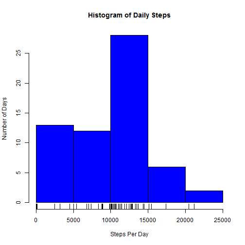
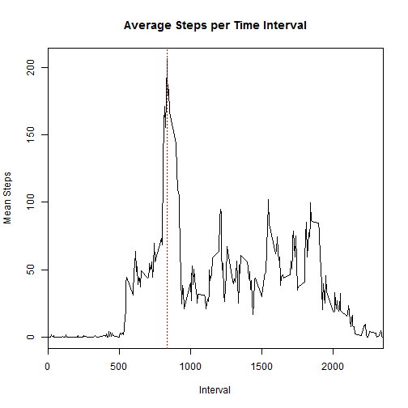
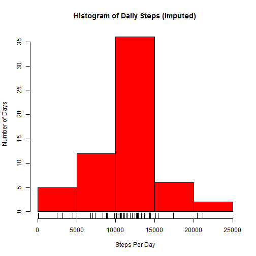
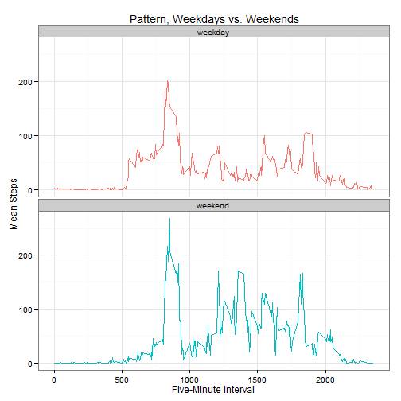
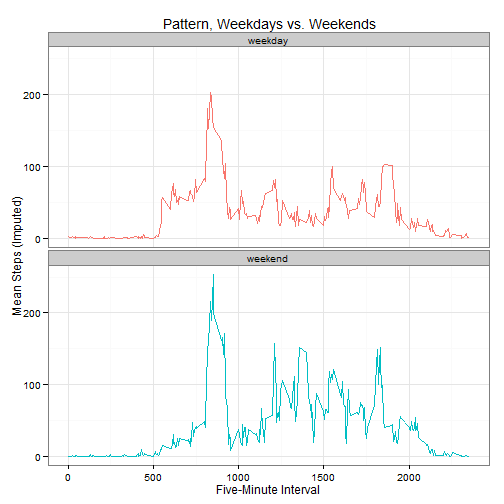
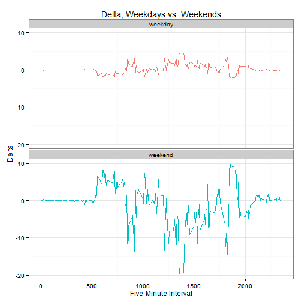
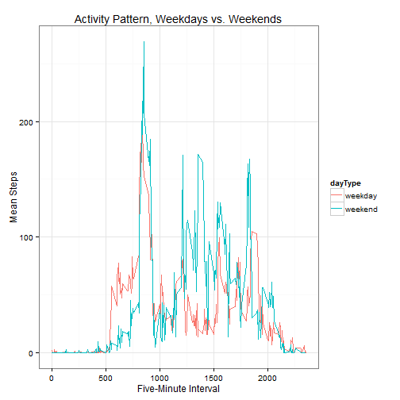
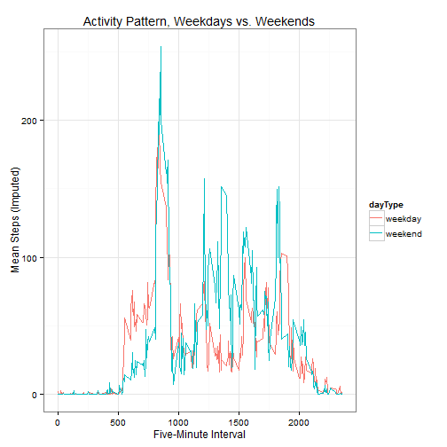
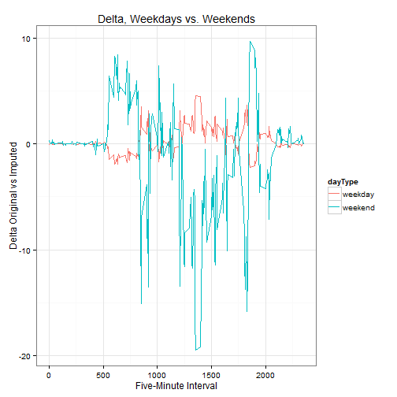

## Introduction

This assignment makes use of data from a personal activity monitoring
device. This device collects data at 5 minute intervals through out the
day. The data consists of two months of data from an anonymous
individual collected during the months of October and November, 2012
and include the number of steps taken in 5 minute intervals each day.

The data for this assignment can be downloaded from the course web
site:

* Dataset: [Activity monitoring data](https://d396qusza40orc.cloudfront.net/repdata%2Fdata%2Factivity.zip) [52K]

The variables included in this dataset are:

* **steps**: Number of steps taking in a 5-minute interval (missing
    values are coded as `NA`)
* **date**: The date on which the measurement was taken in YYYY-MM-DD
    format
* **interval**: Identifier for the 5-minute interval in which
    measurement was taken


The dataset is stored in a comma-separated-value (CSV) file and there
are a total of 17,568 observations in this
dataset.

This analysis uses the following libraries:

* lubridate
* plyr
* ggplot2


## Loading and preprocessing the data

```r
activity <- read.csv('activity.csv',stringsAsFactors=FALSE)
activity$date <- ymd(activity$date)
```


## What is mean total number of steps taken per day?

```r
stepsPerDay <- ddply(activity, .(month=month(date),day=day(date)), summarize,
                     dailySteps = sum(steps,na.rm = TRUE)
)

meanStepsPerDay <- mean(stepsPerDay$dailySteps)
medianStepsPerDay <- median(stepsPerDay$dailySteps)
```

* The mean total number of steps taken per day is 9354.2295082.  
* The median total number of steps taken per day is 10395.


```r
hist(stepsPerDay$dailySteps, col = 'blue',xlab = 'Steps Per Day',ylab = 'Number of Days', main = 'Histogram of Daily Steps')
rug(stepsPerDay$dailySteps)
```

 

## What is the average daily activity pattern?


```r
meanStepsPerInterval <- ddply(activity, .(interval), summarize, meanSteps = mean(steps, na.rm=TRUE))
maxMeanIntervalSteps <- max(meanStepsPerInterval$meanSteps)
maxIntervalMeanSteps <- meanStepsPerInterval$interval[meanStepsPerInterval$meanSteps==maxMeanIntervalSteps]
```


```r
plot(meanStepsPerInterval$interval,meanStepsPerInterval$meanSteps, xlab = 'Interval', ylab = 'Mean Steps', main = 'Average Steps per Time Interval', type = 'l', xaxs = 'i' )
abline(v = maxIntervalMeanSteps, col = 'red', lty = 3)
```

 

* The maximum average steps is 206.1698113, occuring at interval 835.  

## Imputing missing values


```r
rowsWithMissingValues <- sum(is.na(activity))

activityImputed <- merge(activity, meanStepsPerInterval, by = 'interval', all.x = TRUE)

activityImputed$steps <- ifelse(is.na(activityImputed$steps),activityImputed$meanSteps,activityImputed$steps)

stepsPerDayImputed <- ddply(activityImputed, .(month=month(date),day=day(date)), summarize,
                     dailySteps = sum(steps)
)

meanStepsPerDayImputed <- mean(stepsPerDayImputed$dailySteps)
medianStepsPerDayImputed <- median(stepsPerDayImputed$dailySteps)
```


There are 2304 rows with missing values, all for variable **steps**. Imputing the missing values by replacing each with the mean steps for their respective intervals alters the mean and median as follows:

* mean = 1.0766189 &times; 10<sup>4</sup>
* median = 1.0766189 &times; 10<sup>4</sup>  

The mean and median are now equivalent.  


```r
hist(stepsPerDayImputed$dailySteps, col = 'red',xlab = 'Steps Per Day',ylab = 'Number of Days', main = 'Histogram of Daily Steps (Imputed)')
rug(stepsPerDayImputed$dailySteps)
```

 

## Are there differences in activity patterns between weekdays and weekends?

### Missing Values Removed

```r
activity$dayType <- as.factor(ifelse(wday(activity$date) < 6, 'weekday', 'weekend'))

meanStepsPerIntervalPerType <- ddply(activity, .(dayType,interval), summarize, meanSteps = mean(steps, na.rm=TRUE))

plot <- ggplot(meanStepsPerIntervalPerType, aes(x = interval,y = meanSteps))

plot + geom_line(aes(col = dayType)) + facet_wrap(~dayType,ncol=1) + labs(title=" Pattern, Weekdays vs. Weekends") + xlab('Five-Minute Interval') + ylab('Mean Steps') + theme_bw() + theme(legend.position="none")
```

 

### Missing Values Imputed


```r
# imputed version
activityImputed$dayType <- as.factor(ifelse(wday(activityImputed$date) < 6, 'weekday', 'weekend'))
meanStepsPerIntervalPerTypeImputed <- ddply(activityImputed, .(dayType,interval), summarize, meanSteps = mean(steps, na.rm=TRUE))

plot <- ggplot(meanStepsPerIntervalPerTypeImputed, aes(x = interval,y = meanSteps))

# with facets
plot + geom_line(aes(col = dayType)) + facet_wrap(~dayType,ncol=1) + labs(title=" Pattern, Weekdays vs. Weekends") + xlab('Five-Minute Interval') + ylab('Mean Steps (Imputed)') + theme_bw() + theme(legend.position="none")
```

 

### Delta Between Non-Imputed and Imputed Results

```r
# delta

delta <- meanStepsPerIntervalPerTypeImputed$meanSteps - meanStepsPerIntervalPerType$meanSteps
difference <- cbind(meanStepsPerIntervalPerType,delta)

plot <- ggplot(difference, aes(x = interval,y = delta))

# with facets
plot + geom_line(aes(col = dayType)) + facet_wrap(~dayType,ncol=1) + labs(title="Delta, Weekdays vs. Weekends") + xlab('Five-Minute Interval') + ylab('Delta') + theme_bw() + theme(legend.position="none")
```

 

### Alternate Views of Weekday vs. Weekend - Overlay Chart

```r
#overlaid plot - missing values removed
plot <- ggplot(meanStepsPerIntervalPerType, aes(x = interval,y = meanSteps))

plot + geom_line(aes(col = dayType)) + labs(title="Activity Pattern, Weekdays vs. Weekends") + xlab('Five-Minute Interval') + ylab('Mean Steps') + theme_bw()
```

 

```r
#overlaid plot - missing values imputed
plot <- ggplot(meanStepsPerIntervalPerTypeImputed, aes(x = interval,y = meanSteps))

plot + geom_line(aes(col = dayType)) + labs(title="Activity Pattern, Weekdays vs. Weekends") + xlab('Five-Minute Interval') + ylab('Mean Steps (Imputed)') + theme_bw()
```

 

```r
#difference - overlaid plot - alternative view
plot <- ggplot(difference, aes(x = interval,y = delta))

# overlaid plot
plot + geom_line(aes(col = dayType)) + labs(title="Delta, Weekdays vs. Weekends") + xlab('Five-Minute Interval') + ylab('Delta Original vs Imputed') + theme_bw()
```

 
